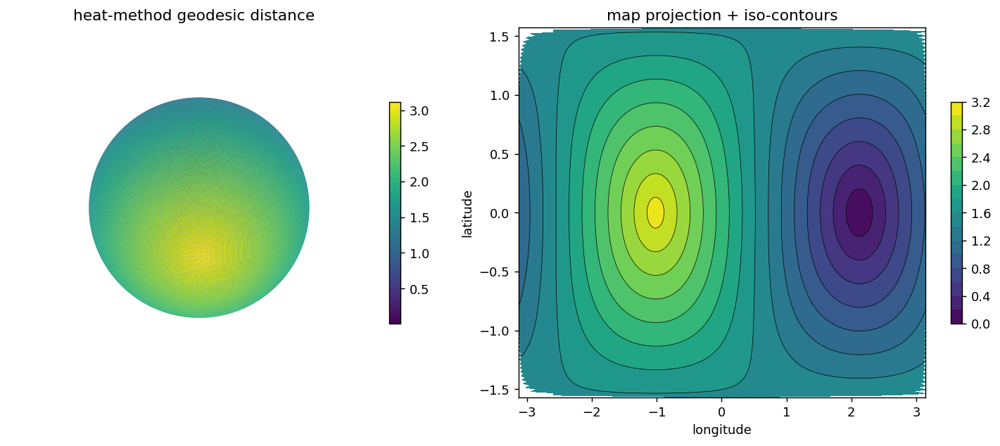

# Discrete Differential Geometry Benchmark — Geodesics & Heat on the Sphere

A compact, mathematically validated implementation of the core
**Discrete Differential Geometry (DDG)** / **Discrete Exterior Calculus (DEC)**
pipeline, benchmarked on the unit sphere where exact answers are known.

It builds simplicial meshes, assembles discrete differential operators, solves
PDEs on the curved surface, and validates every stage against analytical ground
truth — geodesic distance `d(p,q) = arccos(p·q)`, the heat equation, and the
Laplace–Beltrami spectrum `λ_ℓ = ℓ(ℓ+1)`.

```
mesh ──▶ topology (d0, d1, d²=0) ──▶ geometry (mass M, cotan Laplacian L)
     ──▶ heat diffusion ──▶ geodesic distance (heat method)
     ──▶ error & spectral analysis ──▶ performance benchmarking
```

## Why the sphere?

Nontrivial curvature, trivial-to-generate high-quality meshes (icospheres), and
**known closed-form solutions** for geodesic distance, the heat kernel, and the
Laplacian spectrum. That makes it the standard validation domain for geometry
processing — numerics can be measured against truth.

---

## Results at a glance

Validated on an icosphere family (162 → 40,962 vertices):

| Check | Result |
|---|---|
| Euler characteristic `V−E+F` | `= 2` at every level |
| Cochain identity `d1·d0` | `0` to machine precision |
| Mass matrix trace `tr(M)` | `→ 4π` (total sphere area) |
| Cotangent Laplacian `L` | symmetric, PSD, `L·1 = 0`, sparse |
| Geodesic MAE (heat method, 40k verts) | `6.5 × 10⁻³` |
| Empirical convergence rate `error ~ hᵖ` | `p ≈ 0.7` |
| Laplacian spectrum | `0, 2,2,2, 6,6,6,6,6, …` matches `ℓ(ℓ+1)` with multiplicity `2ℓ+1` |

| Geodesic distance | First eigenfunctions (≈ spherical harmonics) |
|---|---|
|  |  |

Full numbers: [`docs/error_report.md`](docs/error_report.md) and
[`docs/performance_report.md`](docs/performance_report.md).

---

## Install

```bash
pip install -r requirements.txt
```

Core stack: `numpy`, `scipy` (sparse linear algebra & eigensolvers), `trimesh`
/ `meshio` (mesh I/O), `matplotlib` + `pandas` (analysis & static figures). The
benchmark renders PNGs with matplotlib's Agg backend so it runs **headless**;
`pyvista`/`polyscope` are optional for interactive viewing.

## Run

```bash
# everything, on icospheres of subdivision level 2..6
python scripts/run_benchmark.py --all --min-sub 2 --max-sub 6

# individual phases
python scripts/run_benchmark.py --phase stats heat geodesic
python scripts/run_benchmark.py --phase convergence --max-sub 7
python scripts/run_benchmark.py --phase spectral
python scripts/run_benchmark.py --phase performance --max-sub 7

# regenerate the markdown reports from results/
python scripts/generate_report.py

# validation tests (topology, d²=0, Laplacian, gradient, heat method)
python tests/test_ddg.py        # or: python -m pytest tests/
```

Outputs land in `figures/` (PNG) and `results/` (CSV/JSON).

---

## Library usage

```python
from ddg import icosphere, HeatMethodSolver, exact_sphere_distance, error_metrics

mesh   = icosphere(6)                       # ~41k vertices on the unit sphere
solver = HeatMethodSolver(mesh, m=1.0)      # prefactors the linear systems once
phi    = solver.distance(source=0)          # geodesic distance from vertex 0

exact  = exact_sphere_distance(mesh.vertices, mesh.vertices[0])
print(error_metrics(phi, exact))            # {'MAE': ..., 'Linf': ..., 'RMSE': ...}
```

```python
from ddg import icosphere, cotangent_laplacian, mass_matrix, eigenpairs

mesh = icosphere(5)
L, _ = cotangent_laplacian(mesh)            # symmetric PSD stiffness, L·1 = 0
M    = mass_matrix(mesh)                     # lumped (diagonal) mass / Hodge ⋆₀
vals, vecs = eigenpairs(L, M, k=20)          # → 0, 2,2,2, 6,6,6,6,6, ...
```

---

## Layout

```
ddg/                      the library
  mesh.py                 TriMesh + icosphere generation, mesh statistics
  topology.py             incidence matrices d0, d1; d²=0 check
  geometry.py             areas, cotan weights, mass matrix, cotangent Laplacian
  heat.py                 implicit-Euler heat diffusion solver
  geodesic.py             the heat method (gradient, divergence, Poisson)
  spectral.py             generalized eigenproblem L φ = λ M φ
  analysis.py             exact distances + MAE / L∞ / RMSE + convergence rate
  visualize.py            headless matplotlib figures
scripts/
  run_benchmark.py        end-to-end driver (8 phases)
  generate_report.py      renders docs/*_report.md from results/
tests/test_ddg.py         mathematical-invariant tests
docs/
  theory.md               the mathematics, mapped to the code
  error_report.md         generated error-analysis report
  performance_report.md   generated performance report
figures/  results/        generated outputs
```

## The mathematics

See [`docs/theory.md`](docs/theory.md) for a self-contained derivation of:
simplicial complexes & incidence matrices, the discrete exterior derivative and
`d²=0`, Hodge stars and the mass matrix, the cotangent Laplacian and its
spectrum, implicit-Euler heat diffusion, the heat method (with Varadhan's
formula), and the convergence / performance analysis.

## Extending beyond the sphere

The operators in `ddg/` take any oriented triangle mesh, so the same pipeline
applies to anatomical, physical, or engineering surfaces — cardiac
electrophysiology, cortical-surface analysis, geometric machine learning, and
numerical PDEs on manifolds. The sphere just provides the ground truth to trust
the implementation first.

## References

- K. Crane, C. Weischedel, M. Wardetzky. *Geodesics in Heat: A New Approach to
  Computing Distance Based on Heat Flow.* ACM TOG, 2013.
- K. Crane. *Discrete Differential Geometry: An Applied Introduction.*
- M. Meyer, M. Desbrun, P. Schröder, A. Barr. *Discrete Differential-Geometry
  Operators for Triangulated 2-Manifolds.* 2003.
