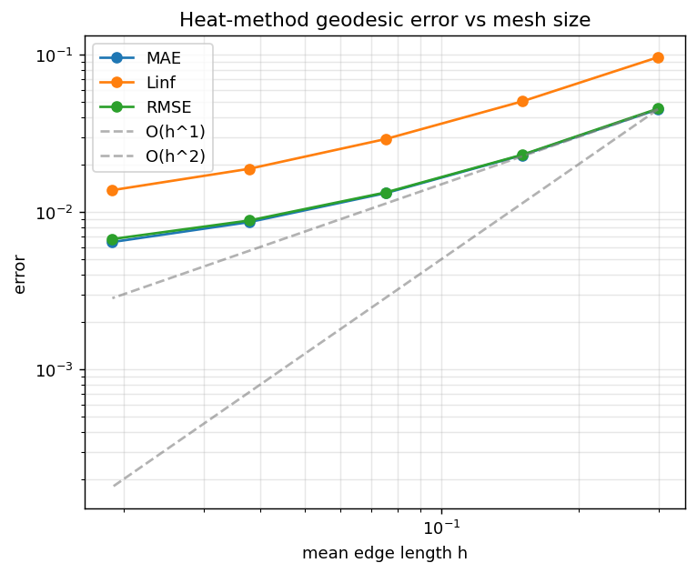
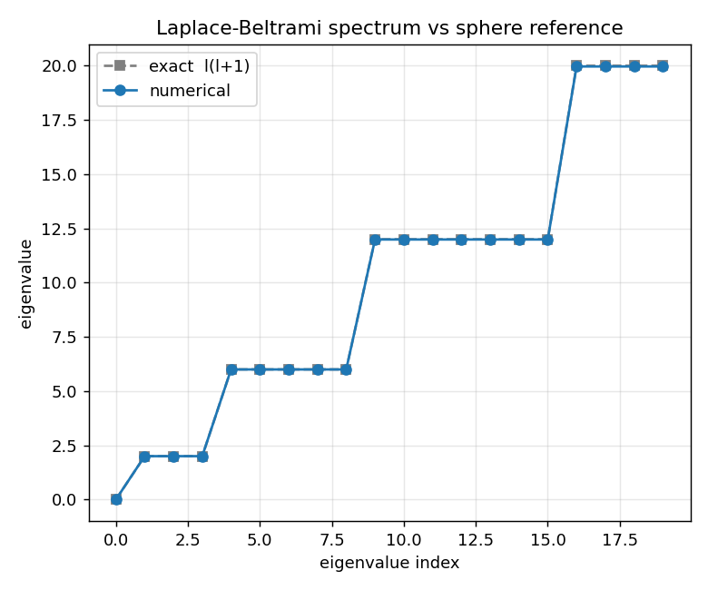
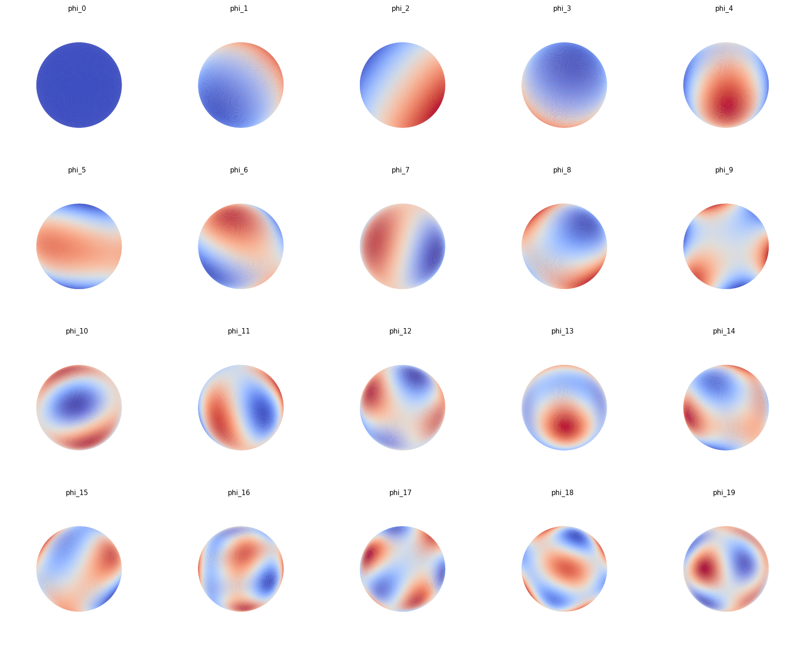

# Error Analysis Report

Numerical results from `scripts/run_benchmark.py`, validated against analytical solutions on the unit sphere.

## Mesh family & topology

Every mesh satisfies the Euler characteristic `V - E + F = 2` and the cochain identity `d1 @ d0 = 0` exactly (residual column).

|   subdivisions |   n_vertices |   n_edges |   n_faces |   euler_characteristic |   mean_edge_length |   area_error_vs_4pi |   d2_residual |
|---------------:|-------------:|----------:|----------:|-----------------------:|-------------------:|--------------------:|--------------:|
|              2 |          162 |       480 |       320 |                      2 |          0.299332  |         0.236522    |             0 |
|              3 |          642 |      1920 |      1280 |                      2 |          0.15073   |         0.0598779   |             0 |
|              4 |         2562 |      7680 |      5120 |                      2 |          0.0754991 |         0.0150167   |             0 |
|              5 |        10242 |     30720 |     20480 |                      2 |          0.0377664 |         0.00375715  |             0 |
|              6 |        40962 |    122880 |     81920 |                      2 |          0.0188853 |         0.000939472 |             0 |

## Geodesic distance convergence (heat method)

Error of the heat-method geodesic distance vs the exact great-circle distance `arccos(p·q)`, over all vertices.

|   subdivisions |   n_vertices |    h_mean |       MAE |      Linf |       RMSE |
|---------------:|-------------:|----------:|----------:|----------:|-----------:|
|              2 |          162 | 0.299332  | 0.0450477 | 0.0965698 | 0.0455219  |
|              3 |          642 | 0.15073   | 0.0230681 | 0.0506752 | 0.0231983  |
|              4 |         2562 | 0.0754991 | 0.0132335 | 0.0292058 | 0.0133661  |
|              5 |        10242 | 0.0377664 | 0.0086494 | 0.0188706 | 0.00885611 |
|              6 |        40962 | 0.0188853 | 0.0064625 | 0.0138058 | 0.00674813 |

### Empirical convergence rate

Fitting `error ~ C·h^p` in log-log space gives:

- **MAE**: p = 0.70
- **Linf**: p = 0.71
- **RMSE**: p = 0.69

The heat method is first-order accurate in the smoothed distance; the observed sub-linear-to-linear slope is consistent with the literature (accuracy is limited by the diffusion time `t = m·h²`).

## Spectral validation

Generalized eigenvalues of `L φ = λ M φ` vs the exact sphere spectrum `λ_ℓ = ℓ(ℓ+1)` with multiplicity `2ℓ+1`.

|   index |   lambda_num |   degree_l |   lambda_exact |   abs_error |
|--------:|-------------:|-----------:|---------------:|------------:|
|       0 |  8.31651e-15 |          0 |              0 | 8.31651e-15 |
|       1 |  2           |          1 |              2 | 4.85396e-08 |
|       2 |  2           |          1 |              2 | 4.85396e-08 |
|       3 |  2           |          1 |              2 | 4.85396e-08 |
|       4 |  5.99786     |          2 |              6 | 0.00213721  |
|       5 |  5.99786     |          2 |              6 | 0.00213721  |
|       6 |  5.99786     |          2 |              6 | 0.00213721  |
|       7 |  5.99786     |          2 |              6 | 0.00213721  |
|       8 |  5.99786     |          2 |              6 | 0.00213721  |
|       9 | 11.9891      |          3 |             12 | 0.0108892   |
|      10 | 11.9891      |          3 |             12 | 0.0108892   |
|      11 | 11.9891      |          3 |             12 | 0.0108892   |
|      12 | 11.9891      |          3 |             12 | 0.0108892   |
|      13 | 11.9896      |          3 |             12 | 0.0104093   |
|      14 | 11.9896      |          3 |             12 | 0.0104093   |
|      15 | 11.9896      |          3 |             12 | 0.0104093   |
|      16 | 19.9665      |          4 |             20 | 0.0334523   |
|      17 | 19.9665      |          4 |             20 | 0.0334523   |
|      18 | 19.9665      |          4 |             20 | 0.0334523   |
|      19 | 19.9665      |          4 |             20 | 0.0334523   |

The first eigenfunctions reproduce the spherical harmonics:

