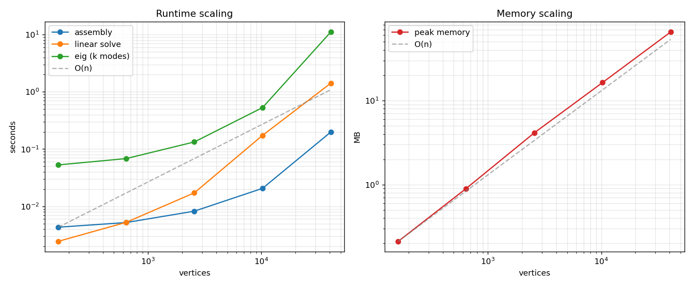

# Performance Report

Timing and peak memory from `scripts/run_benchmark.py --phase performance`. All operators are sparse with O(|V|) nonzeros.

|   subdivisions |   n_vertices |   n_faces |   nnz_L |   t_assembly_s |   t_solve_s |    t_eig_s |   peak_mem_mb |
|---------------:|-------------:|----------:|--------:|---------------:|------------:|-----------:|--------------:|
|              2 |          162 |       320 |    1122 |     0.00431436 |  0.00244597 |  0.0529321 |      0.211923 |
|              3 |          642 |      1280 |    4482 |     0.00520518 |  0.00524959 |  0.0682587 |      0.898615 |
|              4 |         2562 |      5120 |   17922 |     0.00822336 |  0.0172014  |  0.133215  |      4.12991  |
|              5 |        10242 |     20480 |   71682 |     0.0206232  |  0.173619   |  0.530864  |     16.3695   |
|              6 |        40962 |     81920 |  286722 |     0.198679   |  1.4176     | 11.1225    |     65.519    |

## Observed scaling (time ~ n^p, finest two levels)

- **assembly**: p ≈ 1.63
- **linear solve**: p ≈ 1.51
- **eigensolve**: p ≈ 2.19

